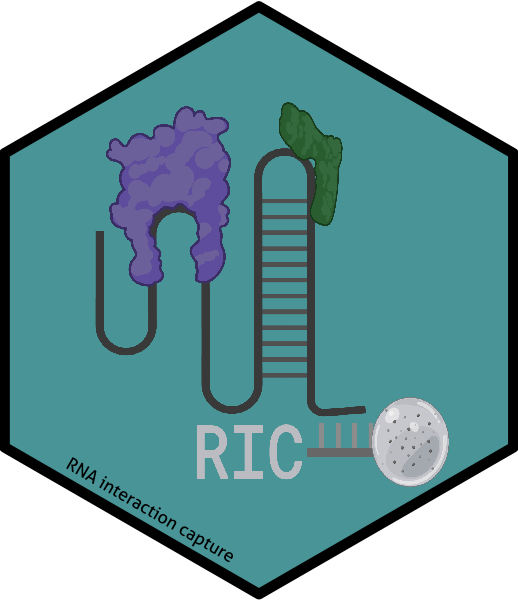

# RIC: RNA interaction capture 


`RIC` is a package that contains a number of functions to analyse RNA-bound proteins detected in on oligo-DT-mediated RNA capture experiments. The package contains published
SILAC data published by [Garcia-Moreno et al 2019](https://www.ncbi.nlm.nih.gov/pmc/articles/PMC6458987/) processed with [MaxQuant](http://www.nature.com/nbt/journal/v26/n12/full/nbt.1511.html)
and follows the analytical steps described by [Perez-Perri et al 2019](https://www.nature.com/articles/s41596-020-00404-1).

### Install

Once installed, load the package by writing in the console

``` r
library(RIC)
```

### Datasets for analysis

Mass-spectrometry dericed datasets available in `RIC` are:

| Data  	|   Description	|
|:---	|:---	|
|  RIC_peptides 	|  RIC from HEK293 infected with SINV virus 	|
|  WCL_peptides	|   WCL from HEK293 infected with SINV virus	|


### Additional information 

Please see the vignette for complete workflow description.
